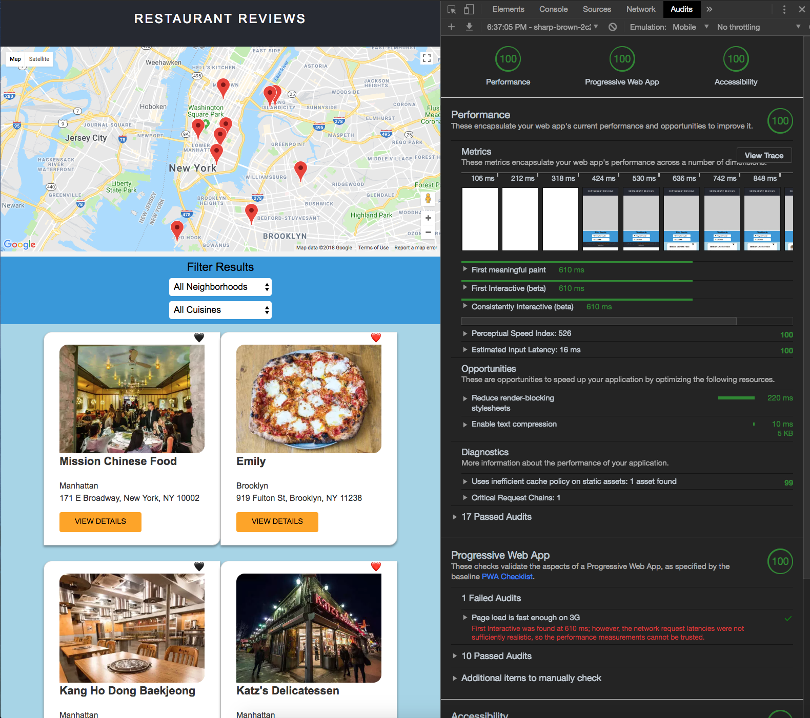

# Mobile Web Specialist Nanodegree Certification

---

This repo includes the completed tasks for stage one, two and three of the Udacity Mobile Web Specialist Restaurant Reviews nanodegree project.

> In order for this project to load correctly in the browser, you have to be running the API server on port `1337` from this repo: [https://github.com/udacity/mws-restaurant-stage-3](https://github.com/udacity/mws-restaurant-stage-3)

 >#### Step 1: git clone repo locally: [https://github.com/udacity/mws-restaurant-stage-3](https://github.com/udacity/mws-restaurant-stage-3)

 >`git clone git@github.com:udacity/mws-restaurant-stage-3.git`

 >#### Step 2: CD into project folder

 > `cd mws-restaurant-stage-3`
 >#### Step 3: Let's start with running commands in your terminal, known as command line interface (CLI)

>###### Install project dependancies
```Install project dependancies
# npm i
```
>###### Install Sails.js globally
```Install sails global
# npm i sails -g
```
>###### Start the server
```Start server
# node server
```
### You should now have access to your API server environment
debug: Environment : development
debug: Port        : 1337


### To test project with HTTPS for Lighthouse Audit use the following link while API server is running on Port: 1337:
>### [https://sharp-brown-2c2431.netlify.com/restaurant.html?id=1](https://sharp-brown-2c2431.netlify.com/restaurant.html?id=1)


#### If you want to run the project locally, clone the repo and install the dependencies:

>`$ git clone https://github.com/bvasilop/mws-restaurant-stage-3-final`

>`$ cd mws-restaurant-stage-3-final`

>`$ npm install`

#### To build and run the project:

>`$ npm start`

##### Production assets are located in the `build/` directory.

#### * If map is not loading properly, be sure to clear all caches and hard reload for service worker to update. (In Chrome right click refresh -empty cache and hard reload)

#### * If testing for offline capabilities, click Applications tab in Chrome dev tools inspector, then click Service Worker and select the offline button.
#### Click refresh and app works offline with cached resources from serviceworker, IndexedDB and localhost.


